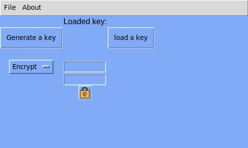

# PyEncrypter-

A Simple Yet powerfull Word Encrypter with python3
GUI Powered By GUIZERO

you can install guizero for python3 like this

sudo pip install guizero

*tested in python3.6 on linux

will use (.key) format to generate and use keys

if you found any bugs report it in the issue page

if you have any designing ideas open a issue for it or contact me on samuelpainadath@gmail.com

Currently the setup.py is not supported for windows and Mac 
Command line version of this project is in the commandline folder
This was a simple project for learning python3 
